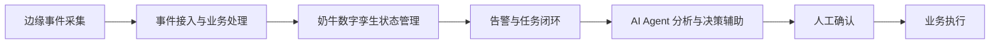
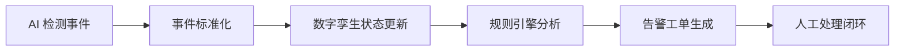
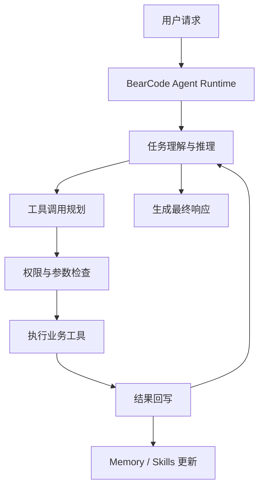
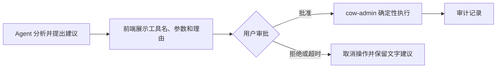
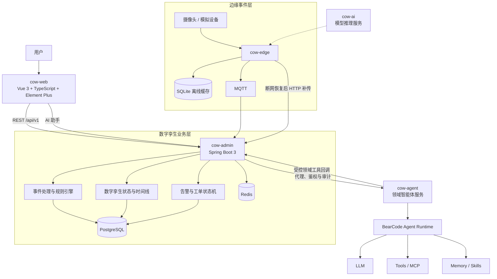
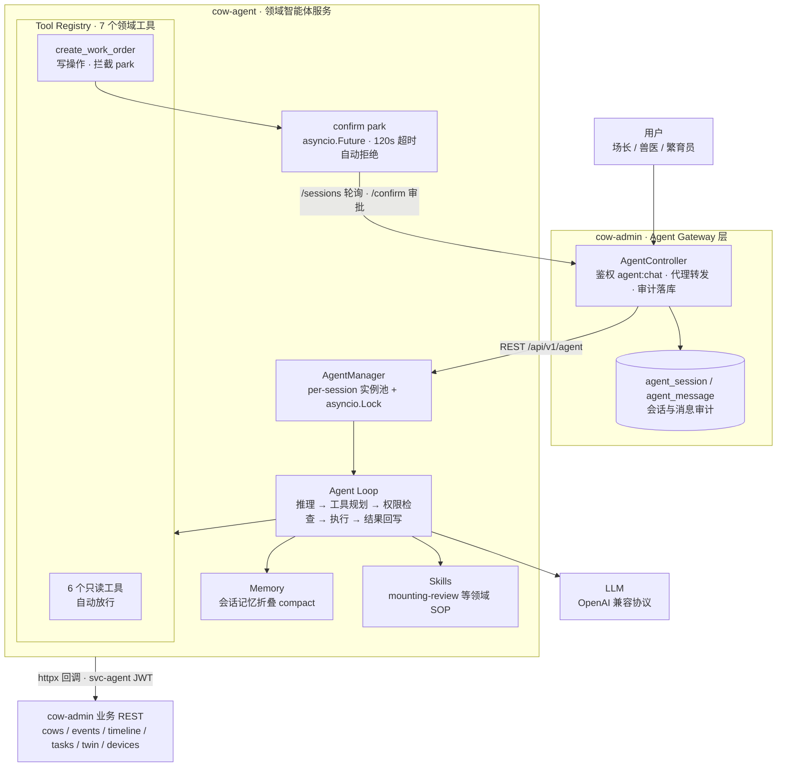
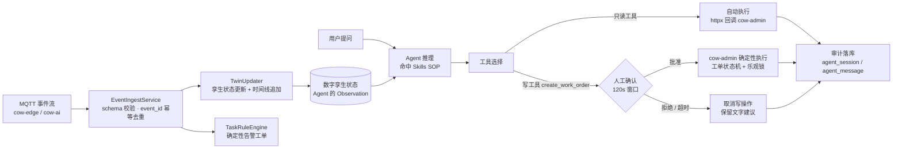

# 奶牛数字孪生 AI Agent 全栈平台

> 面向智慧养殖场景的 AI 全栈应用平台，融合数字孪生、物联网事件处理、自研 Agent Runtime 与智能决策能力，构建从边缘数据采集、状态管理到 AI 辅助决策的完整业务闭环。

## 运行实景（真实运行截取）

| 数据看板 | 牛棚孪生图（103 头牛状态变色） |
| --- | --- |
|  |  |

| 智能体写操作人工确认弹窗 | 设备在线状态（心跳驱动） |
| --- | --- |
|  |  |

> 验证记录：浏览器级主链路 15/15、写操作确认机制 7/7、后端单测 43 项全过——详见 `验收报告_20260914.md` 与 `PROJECT_STATUS.md`；验收脚本见 `acceptance/`。

## 项目定位

本项目旨在探索 **AI Agent 在垂直业务场景中的工程化落地方式**。

项目由三个层次组成：

| 层次 | 定位 | 核心职责 |
| --- | --- | --- |
| 奶牛数字孪生平台 | AI 全栈业务应用 | 事件接入、状态管理、告警工单、可视化与人机协同 |
| BearCode Agent Runtime | 自主构建的通用智能体技术底座 | Agent Loop、工具调用、权限边界、Memory、Skills 与会话恢复 |
| cow-agent | 基于 BearCode 的牧场领域智能体服务 | 事件分析、SOP 复核、任务规划与辅助决策 |

这不是一个简单调用大语言模型接口的聊天应用，而是一套由 **自研 Agent Runtime 驱动的智慧牧场 AI Agent 系统**。系统将模型推理、工具调用、权限控制、记忆管理和真实业务流程连接起来，让 Agent 的判断能够安全、可审计地进入业务闭环。



## 核心能力

### 1. 数字孪生与业务闭环

系统参考真实牧场管理流程，实现：

- 奶牛个体档案与实时状态管理
- AI 事件标准化接入
- 事件时间线追踪
- 告警与工单自动生成
- 工单状态流转与人工复核
- 牛棚、摄像头和边缘节点可视化管理

当前 MVP 聚焦一个可完整演示的垂直切片：

- 20 号牛棚
- 103 头奶牛
- 爬跨事件（`MOUNTING`）
- 跛行事件（`LAMENESS`）

完整业务链路如下：



### 2. 自研 BearCode Agent Runtime

BearCode 是本项目自主构建的 Agent Runtime 技术底座。它不把智能体简化为“输入问题、调用 LLM、返回文本”，而是提供从任务理解到受控执行的完整运行时：



#### Agent Loop

完整支持：

- 用户请求解析与上下文组装
- 模型推理与 Tool Call 解析
- 工具执行和结果回写
- 多轮任务推进
- 任务结束条件判断

#### 工具调用体系

支持：

- 领域业务工具调用
- 外部 MCP 工具接入
- 子 Agent 调度
- 工具参数与执行结果管理
- 只读工具和写操作工具分级

#### 权限边界控制

模型负责思考、规划并提出执行意图，Runtime 负责检查权限、控制工具调用并执行实际操作，从而避免：

- 模型绕过业务系统直接修改数据
- 未经授权的工具调用
- 写操作在用户无感知的情况下执行
- 不可追踪的业务变更

#### Memory、Skills 与会话恢复

支持：

- 长期记忆与项目上下文保存
- Skills 能力沉淀和工作流复用
- Session 保存与长任务状态恢复
- 上下文压缩与多轮会话连续性

### 3. 领域智能体 cow-agent

`cow-agent` 基于 BearCode Agent Runtime 构建，将通用智能体能力与智慧牧场的业务工具、数据权限和 SOP 结合起来：

```text
BearCode Agent Runtime
          ↓
      cow-agent
          ↓
   牧场智能决策助手
```

#### 事件分析

Agent 可以组合调用多个领域工具：

- 查询奶牛档案
- 查询近期事件
- 分析个体时间线
- 解释异常状态
- 汇总并向场长报告

例如，当用户询问“`COW-0042` 今天发生了什么？”时，Agent 会依次查询奶牛档案、近期事件和状态时间线，再基于真实业务数据生成结论，而不是仅依赖模型自身知识回答。

#### SOP 辅助决策

Agent 可以按照已沉淀的业务 Skills 执行标准流程，包括：

- 爬跨事件分析
- 繁殖流程建议
- 跛行与异常事件复核
- 关键证据与事件编号回溯

#### 人机协同执行

所有涉及业务数据变更的操作均遵循“Agent 提议、人工确认、业务系统执行”的边界：



例如，创建工单时，`cow-agent` 只能提出 `create_work_order` 调用请求；前端确认后，才由 `cow-admin` 执行写操作。系统以此保证：

> Agent 负责智能分析与决策建议，业务系统负责确定性执行。

## 系统架构



## 技术架构

### cow-web：前端应用

**技术栈**：Vue 3、TypeScript、Element Plus

负责牛棚可视化、实时事件展示、工单管理、设备状态展示，以及 AI 助手交互与写操作审批。

### cow-admin：业务后端

**技术栈**：Java 17、Spring Boot 3、MyBatis-Plus、PostgreSQL、Redis

负责用户权限、统一事件接入、数字孪生状态、告警工单流程，以及 Agent 请求代理、鉴权与审计。

### cow-ai：AI 推理服务

**技术栈**：Python、FastAPI

负责 AI 模型接口、爬跨和跛行推理服务，以及视觉模型的标准化接入。

### cow-agent：Agent 服务

**技术栈**：Python、FastAPI、BearCode Agent Runtime

负责 Agent 推理、多轮任务推进、工具编排、领域 Skills 执行、写操作确认和智能决策辅助。

### cow-edge：边缘计算

**技术栈**：Python、MQTT、SQLite

负责设备与 AI 事件模拟、本地离线缓存、网络恢复与优先级补传，以及边缘节点心跳上报。

## 工程设计亮点

### 1. 事件幂等处理

每个事件拥有唯一的 `event_id`。系统通过数据库唯一约束和接入层校验，保证重复事件不会重复入库、不会重复更新数字孪生状态，也不会重复触发告警。

### 2. 断网恢复机制

边缘节点在网络不可用时将事件写入本地 SQLite，网络恢复后按照优先级补传：

```text
设备事件
   ↓
SQLite 本地缓存
   ↓
网络恢复
   ↓
HIGH / LOW 优先级补传
   ↓
服务端幂等处理
```

该机制支持离线缓存、优先级队列、成功确认后删除和自动恢复。

### 3. 工单状态机与并发控制

```text
NEW → DISPATCHED → PROCESSING → PENDING_REVIEW → CLOSED
                       └────────────────────────→ CANCELLED
```

系统通过状态机限制非法流转，并使用乐观锁避免并发修改时的 last-write-wins；版本冲突统一返回 `409 Conflict`。

### 4. 迟到事件保护

当事件的 `event_time` 早于当前数字孪生状态对应的事件时间时，系统只追加时间线记录，不回退当前状态，避免断网补传导致实时状态被旧事件覆盖。

### 5. Agent 写操作确认

写工具调用进入确认队列后，由前端展示工具名、参数和调用理由。用户批准后才执行；拒绝或 120 秒未审批则自动取消，确保 Agent 不能绕过人工确认修改业务数据。

### 6. 全链路审计

AI 助手请求经 `cow-admin` 统一代理，用户权限、会话、消息、工具调用结果和 token 用量均可落库追踪，使智能体行为可回溯、可审计。

## 项目目录

```text
cow-digital-twin-platform/
├── cow-web/             # Vue 3 前端（开发端口 5173，容器端口 8089）
├── cow-admin/           # Spring Boot 业务系统（端口 8081）
├── cow-agent/           # FastAPI 领域智能体服务（端口 8003）
│   └── bear/agents/     # BearCode Agent Runtime 核心模块
├── cow-ai/              # FastAPI AI 推理服务（端口 8000）
├── cow-edge/            # Python 边缘事件模拟器
├── deploy/              # Mosquitto 等部署配置
└── docker-compose.yml
```

## 技术栈总览

| 领域 | 技术 |
| --- | --- |
| 业务后端 | Java 17、Spring Boot 3、MyBatis-Plus、PostgreSQL、Redis |
| AI 与 Agent | Python、FastAPI、LLM、Agent Runtime、MCP、Memory、Skills |
| 前端 | Vue 3、TypeScript、Element Plus |
| 边缘与消息 | Python、MQTT、SQLite |
| 工程化 | Docker Compose、JWT、BCrypt、OpenAPI |

## 快速开始

### 环境要求

- JDK 17+
- Maven 3.8+
- Node.js 18+
- Python 3.9+
- Docker 与 Docker Compose（用于一键编排，可选）

### Docker 一键启动

```bash
# 设置 LLM Key（OpenAI 兼容协议，默认使用 DeepSeek 模型）
export LLM_API_KEY=sk-...

# 启动基础服务：PostgreSQL、Redis、Mosquitto、admin、ai、agent、web
docker compose up -d --build

# 可选：启动边缘事件模拟器
docker compose --profile demo up -d cow-edge
```

也可以将 `LLM_API_KEY` 写入 `cow-agent/.env`，该文件已被 `.gitignore` 排除。

启动后可访问：

| 服务 | 地址 |
| --- | --- |
| Web 前端 | <http://localhost:8089> |
| Swagger UI | <http://localhost:8081/swagger-ui.html> |
| cow-ai 健康检查 | <http://localhost:8000/health> |
| cow-agent 健康检查 | <http://localhost:8003/health> |

`cow-agent` 的 `/health` 返回 `llm_configured=true` 后才可进行真实 LLM 对话。

主要环境变量：

| 变量 | 说明 |
| --- | --- |
| `LLM_BASE_URL` | OpenAI 兼容接口地址，默认 `https://api.deepseek.com/v1` |
| `LLM_MODEL` | 模型名称，默认 `deepseek-flash` |
| `LLM_API_KEY` | 模型服务密钥，必填且无默认值 |
| `COW_ADMIN_BASE_URL` | cow-admin 服务地址 |
| `AGENT_USER` / `AGENT_PASSWORD` | Agent 回调业务系统使用的 Service 账号 |
| `CONFIRM_TIMEOUT_SECONDS` | 写操作审批超时，默认 120 秒 |

> Windows PowerShell 可使用 `$env:LLM_API_KEY="sk-..."` 设置当前会话的环境变量。

### 本地开发

> **无 Docker 环境实测路径（2026-09-14 验收通过）**：便携 PostgreSQL 16.10（建库 `cow_db`）+ 便携 Redis 5.0.14 + Mosquitto 2.0.22 便携版（`mosquitto -c acceptance.conf`，匿名监听 1883）即可满足全部依赖；MQTT 链路默认 `MQTT_ENABLED=true` 时生效。

| 模块 | 启动命令 |
| --- | --- |
| cow-admin | `cd cow-admin && mvn spring-boot:run`，需先启动 PostgreSQL、Redis 并创建 `cow_db` |
| cow-ai | `cd cow-ai && pip install -r requirements.txt && uvicorn app.main:app --port 8000` |
| cow-agent | `cd cow-agent && pip install -r requirements.txt && uvicorn app.main:app --port 8003`，需先配置 `LLM_API_KEY` |
| cow-edge | `cd cow-edge && pip install -r requirements.txt && python simulator.py --mode online` |
| cow-web | `cd cow-web && npm install && npm run dev`，默认访问 <http://localhost:5173>，`/api` 已代理到 8081 |

后端首次启动会自动执行 `schema.sql`，并由 `DataInitializer` 初始化账号、角色权限、103 头奶牛档案、4 个摄像头和 1 个边缘节点。

## 默认账号

| 账号 | 密码 | 角色与权限 |
| --- | --- | --- |
| `admin` | `Admin@123` | ADMIN，全部权限 |
| `vet` | `Vet@123` | VET，兽医，包含 `agent:chat` |
| `breeder` | `Breeder@123` | BREEDER，繁育员，包含 `agent:chat` |
| `svc-agent` | `SvcAgent@123` | SERVICE，cow-agent 回调专用，仅允许业务查询和手工建单 |

密码在启动时由 `BCryptPasswordEncoder` 编码入库，不以明文形式保存。

边缘节点 `edge-node-01` 的演示用 `deviceKey` 为 `edge-node-01-secret-2026`。HTTP 上报通过 `X-Device-Key` 请求头传递，心跳通过请求体内的 `deviceKey` 传递。生产部署必须更换此凭证。

## 演示与验收

### 断网恢复演示

前置条件：平台和 MQTT 已启动，当前目录切换到 `cow-edge`。

#### 1. 在线事件流

```bash
python simulator.py --mode online --interval 5
```

前端牛棚图、事件流和工单看板会显示实时数据。可以按 `Ctrl+C` 停止，也可以通过停止 Mosquitto 模拟真实断网；在线发布失败的事件会自动写入本地 `wal_buffer`。

#### 2. 离线缓存

```bash
python simulator.py --mode offline --duration 600 --interval 5
```

- 事件写入本地 `edge_buffer.db`
- `LAMENESS` 和 `DEVICE_OFFLINE` 记为高优先级
- 心跳连续失败 3 次后只写入本地
- 验证 72 小时缓存时可将 `--duration` 设置为 `259200`
- 设备页中的 `edge-node-01` 会在 60 秒后显示为 `OFFLINE`

#### 3. 恢复补传与幂等验证

```bash
python simulator.py --mode reconnect
```

恢复后先补传 HIGH 优先级事件，再补传 LOW 优先级事件；只有服务端确认成功才删除本地记录。脚本结束时会再次发送同一批 `event_id`，用于验证服务端幂等去重。

预期结果：

- 控制台输出 `DEDUP DEMO: ... duplicate alerts = 0`
- 设备页 `pending_count` 归零并恢复 `ONLINE`
- 事件流中同一 `event_id` 只出现一次

### AI 助手演示

前置条件：平台已启动，`cow-agent` 已配置 `LLM_API_KEY`，且 `/health` 显示 `llm_configured=true`。使用 `admin`、`vet` 或 `breeder` 登录前端，进入“AI 助手”页面。

1. 执行 `python simulator.py --mode online --interval 5` 制造事件。`MOUNTING` 事件会触发 24 小时收敛的告警工单。
2. 向 AI 助手提问：“`COW-0042` 今天什么情况？”工具调用轨迹会展示 `query_cow_profile`、`list_events` 和 `query_cow_timeline` 的取数过程。
3. 继续提问：“帮我复核一下这次爬跨要不要安排配种。”Agent 会命中 `mounting-review` SOP，结合档案、近期事件和时间线给出附带 `cow_id`、`event_id` 的复核建议。
4. 当 Agent 调用 `create_work_order` 时，前端会展示工具名、参数和理由。批准后工单看板出现 `NEW` 工单；拒绝或 120 秒内未操作时，系统取消写操作并保留文字建议。
5. 在 `cow-admin` 的 `agent_session` 和 `agent_message` 表中核对对话、工具轨迹和 token 用量审计记录。

### 真实 LLM 联调

1. 在 `cow-agent/.env` 中配置 `LLM_API_KEY=sk-...`。
2. 执行 `uvicorn app.main:app --port 8003` 启动 Agent 服务。
3. 请求 `http://localhost:8003/health`，确认 `llm_configured=true`。
4. 通过前端 AI 助手页面或 `POST /api/v1/agent/chat` 验证对话与工具调用。

## 核心设计细节

### 统一事件契约

边缘模拟器和后端 DTO 使用一致的字段命名：

```text
schema_version / tenant_id / farm_id / event_id / cow_id / device_id /
event_type / event_time / ingest_time / quality / confidence / model_version /
evidence_ref / raw
```

### 幂等去重

`unified_event.event_id` 具有数据库唯一约束。重复插入冲突时返回 `duplicated=true`，不重复落库、不触发数字孪生更新，也不创建重复工单。这是“重复告警为 0”的最终一致性防线。

### 工单状态机

合法流转定义在 `WorkOrderService.TRANSITIONS`。所有变更携带 `version` 并使用 MyBatis-Plus 乐观锁；非法状态流转返回业务错误，并发版本冲突返回 `409 Conflict`。

### 数字孪生迟到事件

当新接收事件的 `event_time` 早于当前状态事件时间时，系统只追加事件时间线，不回退当前孪生状态。

### 设备在线状态

设备在线状态是基于最近心跳计算的属性，阈值为 60 秒，不作为固定状态字段持久化。

### cow-agent 隔离与审批

- Agent 领域能力通过 `CowAgent`、`custom_tools` 和 Skills 注入
- `create_work_order` 等写工具必须进入确认流程
- `svc-agent` 仅拥有业务查询和手工建单权限，不拥有系统管理权限
- 每个 Session 使用独立 Agent 实例和 `asyncio.Lock`，隔离非并发安全状态
- Session 与 Message 经 `cow-admin` 审计落库
- Skills 使用进程级缓存，修改 `SKILL.md` 后需要重启 `cow-agent`

## 成熟能力插入点

| 能力资产 | 插入位置 |
| --- | --- |
| 爬跨 YOLOv8n 权重 | `cow-ai/app/routers/infer.py` 的 `infer_mounting()`；权重路径由 `MOUNTING_WEIGHTS_PATH` 配置 |
| 跛行 YOLOv11 + RTMPose + XGBoost 推理链 | `cow-ai/app/routers/infer.py` 的 `infer_lameness()`；权重目录由 `LAMENESS_WEIGHTS_PATH` 配置 |
| 真实摄像头 RTSP 接入 | 将 `cow-edge/simulator.py` 的 `make_event()` 替换为“RTSP 拉流 → 抽帧 → 调用 cow-ai → 组装事件”，事件契约保持不变 |
| 三维模型资产（glTF） | 在 `cow-web/src/views/barn/index.vue` 的 Three.js 升级插入点替换 SVG 渲染层，数据层保持不变 |
| 完整事件契约 | 扩展 `UnifiedEvent.java` 与 `db/schema.sql` 中的 `unified_event` 表，并同步提升 `schema_version` |

## 当前范围与验收标准

当前版本锁定在 20 号牛棚、103 头奶牛、`MOUNTING` 与 `LAMENESS` 两类 AI 事件，覆盖数字孪生状态、告警工单闭环、摄像头与边缘节点在线状态、断网缓存恢复和牛棚二维可视化。

主要验收标准：

- 结构化事件离线缓存不少于 72 小时
- 基于 `event_id` 幂等去重，重复告警为 0
- 断网重连后按照事件优先级补传
- 工单并发修改使用乐观锁，禁止 last-write-wins
- Agent 写操作必须经用户确认并留下审计记录

## 后续规划

- 接入真实摄像头 RTSP 视频流
- 部署奶牛爬跨与跛行视觉模型
- 引入发情和疾病预测模型
- 升级 Three.js 三维数字孪生展示
- 支持多牧场管理与跨场区分析
- 扩展更多牧场 SOP Skills 与业务工具

## Agent Runtime 执行架构

AI 助手链路的分层执行框架如下，图中每个组件都对应仓库中的真实模块：



- **Agent Gateway（cow-admin）**：`AgentController` 统一承接 AI 助手请求，`@PreAuthorize('agent:chat')` 鉴权、转发 cow-agent，并把每一轮会话与消息（含 token 用量）写入 `agent_session` / `agent_message` 审计表（`AgentController.java:41-64`）。确认请求不 park 在 admin，只转发审批结果。
- **Agent Loop（cow-agent）**：BearCode Agent Runtime 驱动「推理 → 工具规划 → 权限检查 → 执行 → 结果回写」循环（`bear/agents/agent.py` 的 `run_once`），`CowAgent` 子类额外记录每轮工具调用轨迹随响应返回（`cow-agent/app/cow_agent.py:50-61`）。
- **权限检查**：`check_permission` 区分只读放行与写操作拦截，`create_work_order` 被 patch 为必走 confirm（`cow-agent/app/patch.py:61-75`），park 到 `asyncio.Future` 等待前端审批，120 秒超时自动拒绝（`cow-agent/app/agent_manager.py:87-100`）。
- **Memory / Skills**：会话记忆折叠（`bear/agents/session_memory.py`）与领域 SOP Skills（`cow-agent/agent-home/.bear/skills/`）注入推理上下文；`AGENT_HOME` 为运行目录，启动时 chdir 固定（`cow-agent/app/main.py:24-31`）。

## 领域工具 Schema

7 个领域工具以 Function Calling schema 注入模型，全部通过 httpx 回调 cow-admin 业务 REST（`cow-agent/app/cow_tools.py:99-171`）。说明文字为 schema 中 `description` 原文：

| name | 说明 | 关键参数 | 权限级别 |
| --- | --- | --- | --- |
| `query_cow_profile` | 查询单头奶牛的档案与当前数字孪生状态（姿态/区域/健康/发情推断）。 | `cow_id`（必填，如 COW-0042） | 只读 · 自动放行 |
| `query_cow_timeline` | 查询单头奶牛的时间线（事件与状态推断记录，按发生时间倒序）。 | `cow_id`（必填）、`limit`（默认 20，最大 100） | 只读 · 自动放行 |
| `list_events` | 分页查询 AI 事件流（爬跨 MOUNTING / 跛行 LAMENESS / 设备离线 DEVICE_OFFLINE 等）。 | `event_type` / `cow_id` / `device_id` / `page` / `size`（均可选） | 只读 · 自动放行 |
| `get_twin_states` | 获取全棚奶牛的当前数字孪生状态列表。 | 无参数 | 只读 · 自动放行 |
| `list_work_orders` | 分页查询告警工单（繁殖复核 BREEDING_REVIEW / 兽医检查 VET_CHECK / 设备维修 DEVICE_REPAIR）。 | `state` / `type` / `page` / `size`（均可选） | 只读 · 自动放行 |
| `list_devices` | 查询摄像头与边缘节点列表（在线状态为 60s 心跳计算属性，含断网时长与待补传数）。 | 无参数 | 只读 · 自动放行 |
| `create_work_order` | 【写操作，需用户确认】手工创建告警工单。调用前必须向用户说明创建理由。 | `type`、`description`（必填）；`cow_id` / `device_id` / `source_event_id` / `priority`（可选） | **写操作 · 需人工确认** |

所有工具返回给模型的都是字符串（JSON 或友好错误），HTTP 超时 10 秒，service 账号 token 401 时自动重登重试一次（`cow-agent/app/cow_tools.py:24, 69-71`）。

## Agent 决策回路



以「复核 COW-0042 这次爬跨要不要安排配种」为例，Agent 命中 `mounting-review` SOP 后严格按流程执行（`cow-agent/agent-home/.bear/skills/mounting-review/SKILL.md`），每步都用工具取数、禁止跳步：

1. **查档案**：`query_cow_profile(cow_id="COW-0042")`，确认牛只状态（ACTIVE 与否）、所在区域、当前孪生状态中的 `estrus_status` / `health_status` 推断值。
2. **查近期爬跨事件**：`list_events(event_type="MOUNTING", cow_id="COW-0042")`，关注事件数量与时间分布（21 天左右的发情周期是否复现）与 `confidence` 置信度（低置信度提醒人工查看 `evidence_ref` 视频片段）。
3. **查时间线**：`query_cow_timeline(cow_id="COW-0042")`，对照历史爬跨 / 配种 / 妊检记录，判断本次是否符合发情周期规律。
4. **给复核建议**：结论（疑似发情成立 / 证据不足 / 疑似误报）必须引用具体 `cow_id`、`event_id`；如需创建工单，先说明理由再调用 `create_work_order`（写操作，等用户确认）。
5. **确认与执行**：写工具被拦截 park，前端弹窗展示工具名、参数和理由；批准后由 cow-admin 确定性执行并落库，拒绝或 120 秒未审批则自动取消。

## 失败处理设计

| 失败场景 | 处理策略 | 代码出处 |
| --- | --- | --- |
| LLM 未配置 API Key | chat 前置校验，返回 503 并提示配置方式 | `cow-agent/app/agent_manager.py:72-74`、`cow-agent/app/main.py:55-56` |
| LLM / 智能体调用异常 | 兜底为 HTTP 502「智能体调用失败」，不向客户端抛堆栈 | `cow-agent/app/main.py:57-59` |
| 写操作 120 秒未审批 | `asyncio.wait_for` 超时自动拒绝，pending 清理后会话恢复可用 | `cow-agent/app/agent_manager.py:95-100`、`cow-agent/app/config.py:24` |
| 用户拒绝写操作 | confirm 返回 False，工具结果以「User denied this action.」回写模型，Agent 转为保留文字建议 | `cow-agent/bear/agents/agent.py:1449` |
| 领域工具调用失败 | `ToolError` 转为友好错误字符串返回给模型；任何未预期异常兜底为「Error: 工具执行异常」，不抛穿 Agent Loop | `cow-agent/app/cow_tools.py:88-89、182-194` |
| cow-admin 不可达 / 超时 | httpx 超时 10 秒；连接失败返回「无法连接 cow-admin」友好错误 | `cow-agent/app/cow_tools.py:24、67-68` |
| service 账号 token 过期 | 401 自动重登并重试一次 | `cow-agent/app/cow_tools.py:69-71` |
| cow-agent 宕机 / 不可达 | admin 侧降级为 `BizException(502)`；该路径已被单测 `agentDownMapsTo502BizException` 覆盖 | `cow-admin/.../agent/service/AgentServiceClient.java:48, 61`、`cow-admin/.../agent/service/AgentServiceClientTest.java:73-77` |
| admin 等待 agent 响应超时 | RestClient read 超时 150 秒，覆盖 120 秒确认等待窗口 | `cow-admin/.../agent/service/AgentServiceClient.java:25` |
| 输入 / 输出校验 | 空消息 400；对无 pending 会话重复 confirm 返回 404；事件接入校验 `schema_version` | `cow-agent/app/main.py:51-52、68`、`cow-admin/.../event/service/EventIngestService.java:51-54` |
| 迟到事件 | 只追加时间线，不回退当前孪生快照 | `cow-admin/.../twin/TwinUpdater.java:73-79` |

## 数字孪生状态对象

单牛数字孪生当前状态持久化在 `twin_state` 表（`cow-admin/src/main/resources/db/schema.sql:76-84`），`state` 为 JSONB，内容约定见 `TwinState.java:13-16`：

```json
{
  "cow_id": "COW-0042",
  "state": {
    "posture": "UNKNOWN",
    "zone": "ZONE-B",
    "health_status": "NORMAL",
    "estrus_status": "SUSPECTED_HEAT"
  },
  "state_nature": "INFERRED",
  "source_event_id": "<触发本次状态变更的 event_id>",
  "event_time": "2026-09-14T15:44:45",
  "version": 7,
  "updated_at": "2026-09-14T15:44:45"
}
```

| 字段 | 类型 | 说明 |
| --- | --- | --- |
| `cow_id` | VARCHAR(32) PK | 牛只编号 |
| `state` | JSONB | 状态键值：`posture` / `zone` / `health_status`（NORMAL \| LAMENESS_RISK）/ `estrus_status`（NORMAL \| SUSPECTED_HEAT） |
| `state_nature` | VARCHAR(16) | 状态性质：MEASURED / INFERRED / MANUAL |
| `source_event_id` | VARCHAR(64) | 触发本次状态变更的来源事件 |
| `event_time` | TIMESTAMP | 来源事件的发生时间（迟到判定基准） |
| `version` | INT | 乐观锁版本号，冲突时有限重试 3 次 |
| `updated_at` | TIMESTAMP | 状态最后更新时间 |

更新规则由 `TwinUpdater` 实现（`cow-admin/.../twin/TwinUpdater.java:20-28`）：`MOUNTING` 高置信（confidence ≥ 0.8）→ `estrus_status = SUSPECTED_HEAT`；`LAMENESS` → `health_status = LAMENESS_RISK`；`DEVICE_*` 事件不改变牛只状态；每个牛只相关事件都追加 `CowTimeline`。**迟到事件（`event_time` 早于当前状态对应的事件时间）只追加时间线，不回退快照**，避免断网补传的旧事件覆盖实时状态（`TwinUpdater.java:73-79`）。

## 一句话总结

> 本项目构建了一套由自研 BearCode Agent Runtime 驱动的 AI 全栈智慧牧场平台，将 Agent 推理能力与数字孪生业务系统结合，实现从边缘数据采集、业务流程管理到智能决策辅助的完整闭环。
