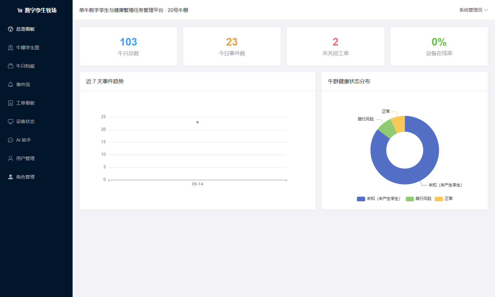
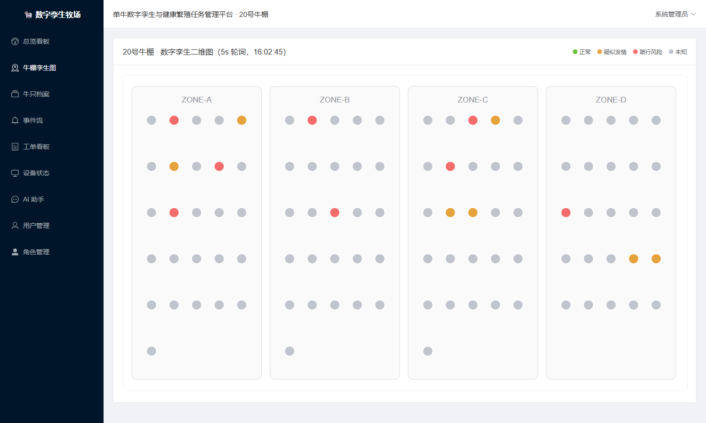
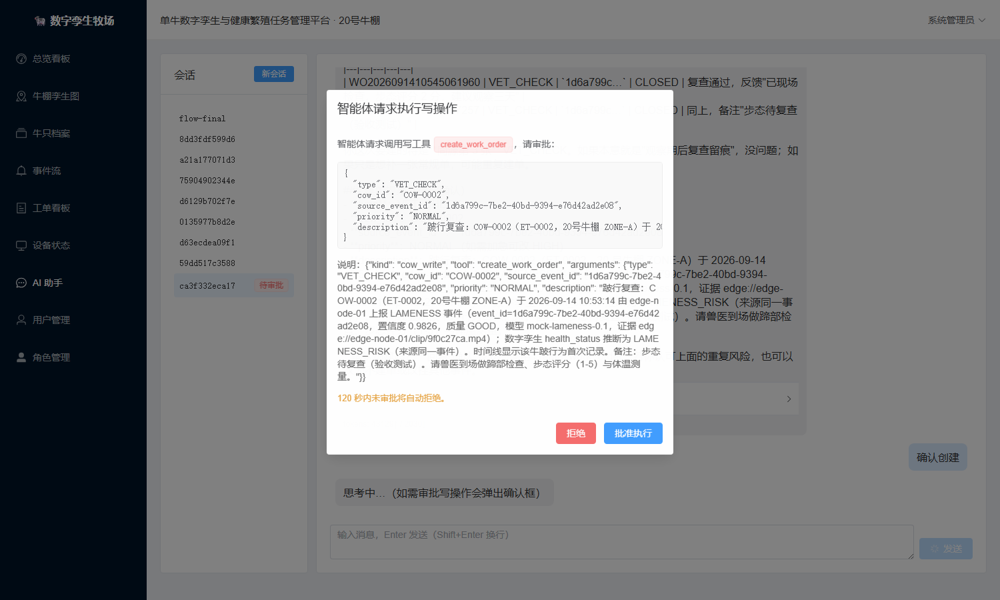
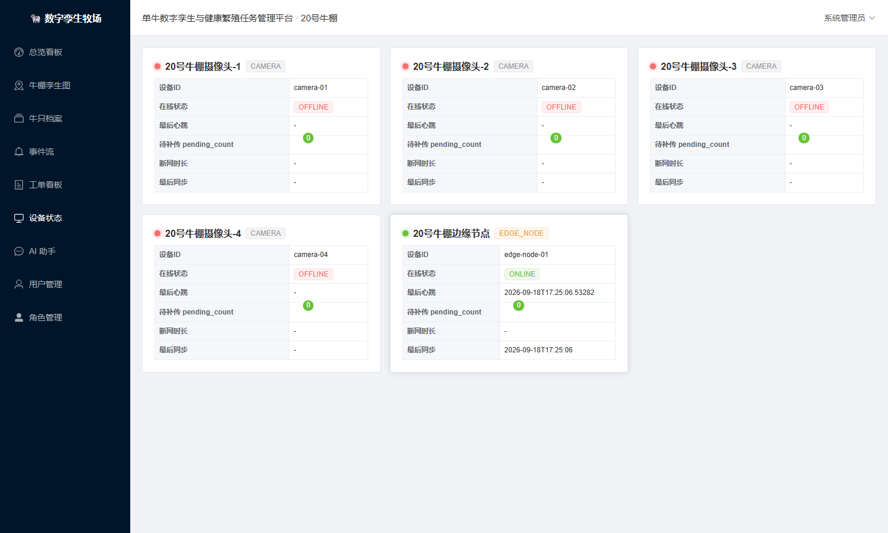
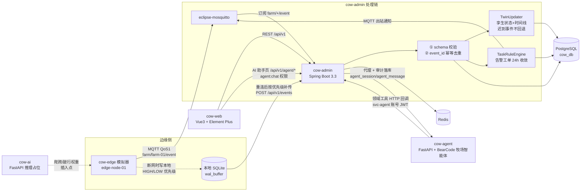

# 单牛数字孪生与健康繁殖任务管理平台

> 奶牛数字孪生系统**首场验证版（MVP）**：以 20 号牛棚 103 头奶牛为垂直切片，打通
> 「AI 事件 → 幂等接入 → 数字孪生状态 → 告警工单闭环 → 断网缓存恢复 → 牛棚可视化」全链路。

## 运行实景（真实运行截取）

| 数据看板 | 牛棚孪生图（103 头牛状态变色） |
| --- | --- |
|  |  |

| 智能体写操作人工确认弹窗 | 设备在线状态（心跳驱动） |
| --- | --- |
|  |  |

> 验证记录：浏览器级主链路 15/15、写操作确认机制 7/7、后端单测 21 项全过——详见 `验收报告_20260914.md` 与 `PROJECT_STATUS.md`。

## 架构



**牧场智能体层（cow-agent）**：基于 BearCode 技术母版（自研 Agent Harness：agent loop /
工具权限边界 / Skills / 会话记忆）服务化封装，承担「决策智能」——事件排查、SOP 复核建议、
对场长汇报。写操作（create_work_order）走 confirm_fn park → 前端审批弹窗 → 放行，
120s 未审批自动拒绝；业务闭环的确定性仍由 cow-admin 保证。

## 范围说明

**本版锁定**：20 号牛棚 / 103 头奶牛 / 爬跨（MOUNTING）与跛行（LAMENESS）两类 AI 事件 /
数字孪生状态 / 告警工单闭环 / 摄像头与边缘节点在线状态 / 断网缓存与恢复演示 / 牛棚二维可视化。

**验收标准**：结构化事件离线缓存 ≥72h；重复告警 0（event_id 幂等去重）；断网重连后按优先级补传；
工单并发禁止 last-write-wins（乐观锁，冲突返回 409）。

**明确不做**（企业规划后续阶段）：多租户运营体系、预测性智能（发情/疾病预测模型在线化）、
三维 GIS 与数字牧场漫游、巡检/饲喂机器人调度、真实产线 RTSP 接入。

## 快速开始

### Docker 一键启动

```bash
# 先设置 LLM key（OpenAI 兼容协议，默认 DeepSeek V4.1 Flash）
export LLM_API_KEY=sk-...   # 或写进 cow-agent/.env（已被 .gitignore 排除）
docker compose up -d --build                 # 基础服务（db/redis/mosquitto/admin/ai/agent/web）
docker compose --profile demo up -d cow-edge # 可选：边缘模拟器
```

- 前端：http://localhost:8089
- API 文档（Swagger UI）：http://localhost:8081/swagger-ui.html
- cow-ai：http://localhost:8000/health
- cow-agent：http://localhost:8003/health（`llm_configured` 为 true 才可对话）

cow-agent 环境变量：`LLM_BASE_URL`（默认 `https://api.deepseek.com/v1`）、
`LLM_MODEL`（默认 `deepseek-flash`）、`LLM_API_KEY`（必填，无默认值）、
`COW_ADMIN_BASE_URL`、`AGENT_USER` / `AGENT_PASSWORD`（service 账号）、
`CONFIRM_TIMEOUT_SECONDS`（写操作审批超时，默认 120）。

### 本地开发

> **无 Docker 环境实测路径（2026-09-14 验收通过）**：便携 PostgreSQL 16.10（建库 `cow_db`）+ 便携 Redis 5.0.14 + **Mosquitto 2.0.22 便携版**（`mosquitto -c acceptance.conf`，匿名监听 1883）即可满足全部依赖；MQTT 链路默认 `MQTT_ENABLED=true` 时生效。
> 与黄瓜平台并存时端口避让：`cow-web` 用 `npm run dev -- --port 5174`、`cow-ai` 用 `--port 8001`。

| 模块 | 命令 |
| --- | --- |
| cow-admin | `cd cow-admin && mvn spring-boot:run`（需先起 PostgreSQL/Redis，建库 cow_db） |
| cow-ai | `cd cow-ai && pip install -r requirements.txt && uvicorn app.main:app --port 8000` |
| cow-agent | `cd cow-agent && pip install -r requirements.txt && uvicorn app.main:app --port 8003`（先配 LLM_API_KEY，见 cow-agent/.env 或环境变量） |
| cow-edge | `cd cow-edge && pip install -r requirements.txt && python simulator.py --mode online` |
| cow-web | `cd cow-web && npm install && npm run dev`（http://localhost:5173，已代理 /api → 8081） |

后端首次启动自动执行 `schema.sql` 并由 `DataInitializer` 初始化空库数据
（账号、角色权限、103 头牛档案、4 摄像头 + 1 边缘节点）。

## 默认账号

| 账号 | 密码 | 角色 |
| --- | --- | --- |
| admin | Admin@123 | ADMIN（全部权限） |
| vet | Vet@123 | VET（兽医，含 agent:chat） |
| breeder | Breeder@123 | BREEDER（繁育员，含 agent:chat） |
| svc-agent | SvcAgent@123 | SERVICE（cow-agent 回调专用：仅业务查询 + 手工建单，无系统管理权限） |

密码在启动时由 `BCryptPasswordEncoder` 现场编码入库，不落明文。

**设备凭证**：边缘节点 `edge-node-01` 的 deviceKey 为 `edge-node-01-secret-2026`
（HTTP 上报走 `X-Device-Key` 头，心跳走 body 内 `deviceKey`；仅演示用，生产必须更换）。

## 断网恢复演示脚本（三步）

前置：平台已启动且 MQTT 可用，`cd cow-edge`。

```bash
# ① 在线跑一会儿，前端牛棚图/事件流/工单看板可见实时数据
python simulator.py --mode online --interval 5
#    （Ctrl+C 停止；也可以用 docker stop cow-mosquitto 模拟真实断网，
#     online 模式发布失败会自动落本地 wal_buffer）

# ② 断网缓存：事件全部写入本地 SQLite（edge_buffer.db），
#    LAMENESS/DEVICE_OFFLINE 记为高优先级，心跳连续失败 3 次后只写本地。
#    ≥72h 缓存验收：--duration 259200；本地文件持久保留，缓存时长可配。
python simulator.py --mode offline --duration 600 --interval 5
#    观察点：cow-admin 设备页 edge-node-01 在 60s 后变 OFFLINE，断网时长持续累计

# ③ 恢复补传：先 HIGH 后 LOW 逐条 POST，成功才删本地；
#    结束后自动把同一批 event_id 重发一遍 → 服务端幂等去重，重复告警 0
python simulator.py --mode reconnect
#    观察点：控制台打印 "DEDUP DEMO: ... duplicate alerts = 0"；
#    设备页 pending_count 归零、状态恢复 ONLINE；事件流中同一 event_id 只出现一次
```

## AI 助手演示脚本（牧场智能体）

前置：平台已启动，cow-agent 已配 `LLM_API_KEY` 且 `/health` 显示 `llm_configured=true`；
用 admin / vet / breeder 登录前端（均有 agent:chat 权限），进左侧「AI 助手」页。

1. 先跑边缘模拟器制造事件：`python simulator.py --mode online --interval 5`
   （爬跨 MOUNTING 事件触发 24h 收敛告警工单）；
2. AI 助手提问：「COW-0042 今天什么情况？」
   → 观察**工具调用轨迹折叠区**：query_cow_profile / list_events / query_cow_timeline 依次取数；
3. 追问：「帮我复核一下这次爬跨要不要安排配种」
   → 命中 `mounting-review` SOP（查档案 → 近期爬跨事件 → 时间线 → 复核建议，附 cow_id / event_id）；
4. 若智能体建议建单并调用 create_work_order → **前端弹出写操作确认框**
   （工具名 / 参数 / 理由）→ 点「批准执行」→ 工单看板出现 NEW 工单；
   点「拒绝」或 120s 不操作 → 自动拒绝，智能体改用文字建议；
5. 审计核对：cow-admin 的 `agent_session` / `agent_message` 表落有全量对话与 token 用量。

### 真实 LLM 联调步骤

1. 把 key 写入 `cow-agent/.env`：`LLM_API_KEY=sk-...`（该文件已被 .gitignore 排除）；
2. `uvicorn app.main:app --port 8003` 启动，`curl localhost:8003/health` 确认 `llm_configured=true`；
3. 走前端 AI 助手页或直连 `POST /api/v1/agent/chat` 验证对话与工具调用。

## 成熟代码插入点清单

| 资产 | 插入位置 |
| --- | --- |
| 爬跨 YOLOv8n 权重 | `cow-ai/app/routers/infer.py` → `infer_mounting()` 顶部插入点注释；权重放 `MOUNTING_WEIGHTS_PATH` |
| 跛行 YOLOv11 + RTMPose + XGBoost 推理链 | `cow-ai/app/routers/infer.py` → `infer_lameness()` 顶部插入点注释；权重目录 `LAMENESS_WEIGHTS_PATH` |
| 真实摄像头 RTSP 接入 | `cow-edge/simulator.py` → `make_event()` 替换为「RTSP 拉流 → 抽帧 → 调 cow-ai 推理 → 组装事件」，事件契约不变 |
| 三维模型资产（glTF） | `cow-web/src/views/barn/index.vue` → 文件中 "Three.js 三维升级插入点" 注释，SVG 渲染层整体替换，数据层不变 |
| 规划书完整事件契约 | `cow-admin/modules/event/entity/UnifiedEvent.java` + `db/schema.sql` 的 `unified_event` 表，按规划书扩展字段并升 `schema_version` |

## 核心设计

- **事件契约**：`schema_version / tenant_id / farm_id / event_id / cow_id / device_id /
  event_type / event_time / ingest_time / quality / confidence / model_version /
  evidence_ref / raw`，边缘模拟器与后端 DTO 字段名严格一致。
- **幂等去重**：`unified_event.event_id` 数据库唯一约束；重复插入冲突即返回
  `duplicated=true`，绝不重复落库、绝不触发孪生更新与工单（重复告警 0 的最后一道防线）。
- **工单状态机**：`NEW→DISPATCHED→PROCESSING→PENDING_REVIEW→CLOSED/CANCELLED`
  （另 PROCESSING→CANCELLED），合法流转写死在 `WorkOrderService.TRANSITIONS`，非法流转抛业务异常；
  所有变更携带 `version` 走 MyBatis-Plus 乐观锁，冲突返回 409，禁止 last-write-wins。
- **孪生迟到事件**：`event_time` 早于当前状态事件时间的，只追加时间线、不回退当前状态。
- **设备在线**：计算属性（60s 心跳阈值），不入库状态字段。
- **牧场智能体（cow-agent）**：BearCode（自研 Agent Runtime，
  核心模块原样复用）**零改动嵌入**——
  13 个核心模块原样拷贝到 `cow-agent/bear/agents/`，领域适配全部通过
  子类化（CowAgent 重写 `_execute_tool_call`）、custom_tools 注入、
  运行时 patch（`app/patch.py`：print_*/spinner no-op、写工具进 confirm、
  关闭后台 skill 进化）完成，母版原目录未动一行（嵌入副本含 2 处已在验收报告列明的 bugfix）。
  已知限制：Agent 实例非并发安全（已用 per-session 实例 + asyncio.Lock 隔离）；
  `_auto_save` 每轮全量写盘，演示规模可接受；改 SKILL.md 后需重启 cow-agent
  （skills 为进程级缓存）。

## 环境要求

JDK 17+ / Maven 3.8+ / Node 18+ / Python 3.9+ / Docker（可选，用于一键编排）

## 目录结构

```
cow-digital-twin-platform/
├── cow-admin/    # Spring Boot 3.3.4 业务后端（端口 8081）
├── cow-ai/       # FastAPI 推理占位服务（端口 8000）
├── cow-agent/    # FastAPI + BearCode 牧场智能体（端口 8003；bear/ 为母版原样拷贝）
├── cow-edge/     # Python 边缘事件模拟器（断网缓存演示核心）
├── cow-web/      # Vue3 + TS + Element Plus 前端（端口 5173 / 容器 8089）
├── deploy/       # mosquitto 配置
└── docker-compose.yml
```
